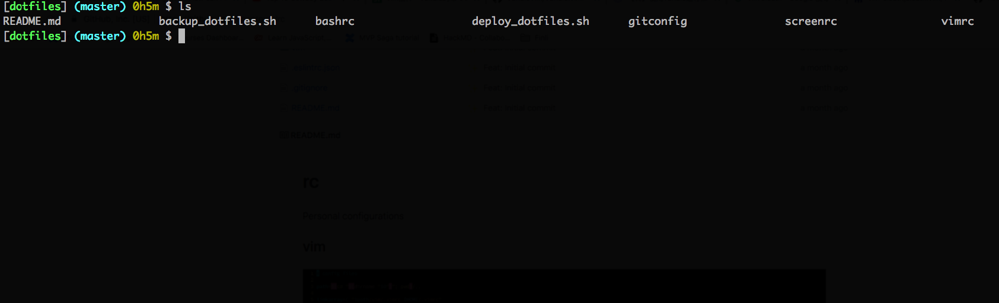

# My .rc files configuration

## List of Contents
1. [bashrc](#bash)
2. [vimrc](#vim)
3. [screenrc](#screen)

## Bash

## Vim

plugin I used: 
* The-NERD-tree
* vim-surround

what this vimrc will give you:

* it will automatically show relative line number in normal mode
while absolute line nubmer in insert mode
* ruler to indicate which line you are at now
* F2 to toggle line number
* F5 to toggle The-NERD-tree

## Screen

